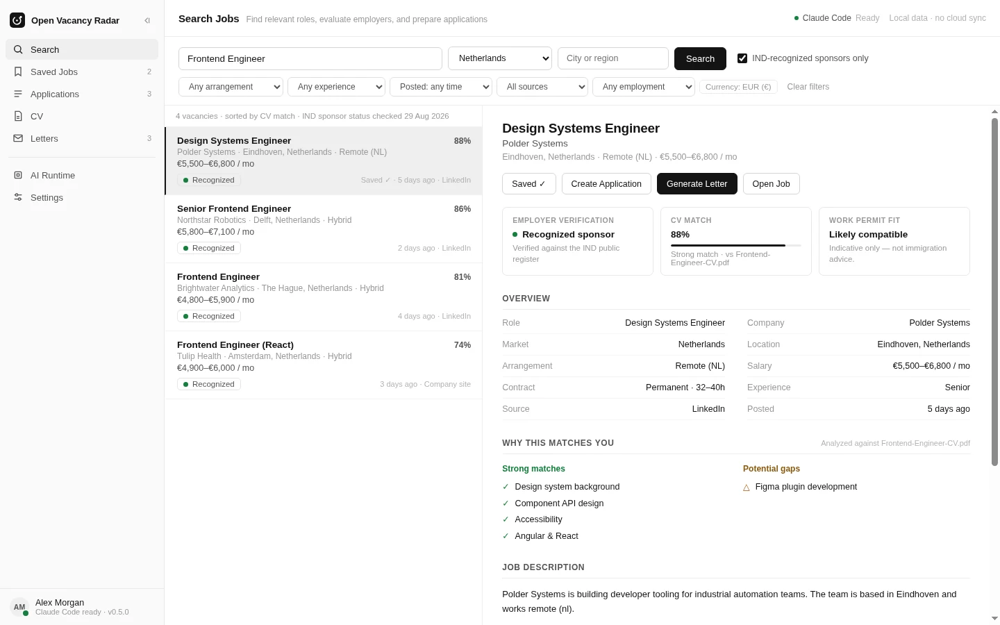

# Open Vacancy Radar

An open-source, local-first Electron desktop app for discovering frontend-developer vacancies,
tracking applications, and preparing CVs and cover letters. It uses no external database, no cloud
account, and no API key held by this project. Application data lives in an embedded SQLite
workspace on the user's own machine; AI features run through the reusable AgentDock runtime, which
drives AI agent CLIs already installed and authenticated on the user's computer (starting with
[Claude Code](https://docs.anthropic.com/en/docs/claude-code) and
[Codex](https://github.com/openai/codex)), without this project ever receiving a password, token, or
API key.



_Reference interface shown with sample data; production behavior comes from the Electron source in
this repository, not the bundled prototype used to prepare the image._

## What this is

A personal job-search workspace built around two real, verified discovery pipelines. There is no
third "generic country" pipeline: every match is either Netherlands-sponsor-verified or
worldwide-remote-verified, never a placeholder.

- **Netherlands:** frontend vacancies cross-checked against the IND's official recognised-sponsor
  register, so a match means the employer is a verified sponsor, not just a keyword hit.
- **Worldwide / remote:** frontend-only roles from ~50 researched public sources (ATS APIs, RSS
  feeds, keyed job-board APIs), filtered for genuinely remote, non-US-only eligibility.

Both pipelines are deterministic-first: official ATS APIs and structured feeds before plain HTTP,
before JSON-LD, before HTML parsing, with a narrowly-scoped headless-browser fallback only where
nothing else works. See [packages/vacancy-engine](packages/vacancy-engine) for the engine itself,
vendored from the standalone `ind-job-radar` CLI project and ported from PostgreSQL to an embedded
`better-sqlite3` database so the desktop app needs no external services at all.

Vacancy coverage is a product requirement: a lawful public source is integrated by default in the
broadest mode its evidence supports. Sources that take longer to implement remain planned.
Unclear republication rights use a factual linked index; explicit prohibitions, authentication or
partner boundaries, and technical access controls stop ingestion. See
[the job source policy](docs/job-source-policy.md).

On top of that, the desktop app is a full personal tracker:

- **Search:** run either pipeline on demand, save leads, or open the CV assistant on any result.
- **Saved Jobs** / **Applications:** track status end to end, with confirm-before-delete and a
  short undo window on every delete.
- **CV Library:** upload or hand-enter multiple CVs, one marked default, each usable for AI
  gap-analysis against a specific vacancy.
- **Letters:** generate motivation letters, cover letters, recruiter messages, or short
  application-form blurbs from a CV + vacancy pair, in a chosen tone and length, with a library of
  saved drafts.
- **Settings:** theme (light/dark/system), density, default market, and data export/reset, all
  persisted locally.
- **AI Runtime:** the AgentDock provider panel: pick a provider (Claude Code, Codex) and, where
  supported, a specific model, and watch a run's events stream live.

This desktop app relies on CLIs the user already has installed and authenticated, not its own
subscription or API key: if a user already has `claude` or `codex` installed and logged in, Open
Vacancy Radar can use that existing session for local AI workflows (gap analysis, letter drafting).
The installed CLI stays the sole authentication and provider boundary; this project never receives
a password, token, or API key.

```
Renderer (React) ──IPC──▶ Electron main ──@agent-dock/client──▶ Local Daemon (Fastify, protocol v1)
                              │                                          │
                    embedded SQLite (workspace +               Unified Agent Runtime
                    vendored vacancy-engine)              ├── Claude Code adapter ──▶ claude CLI
                                                           └── Codex adapter ────────▶ codex CLI
```

The renderer never calls the daemon directly. Only Electron's main process does, through the
typed `@agent-dock/client` SDK. See
[SECURITY.md](SECURITY.md#renderer-never-talks-to-the-daemon-directly) for why, and
[Client SDK](#client-sdk) below for what that package looks like from the outside.

See [docs/architecture.md](docs/architecture.md) for the full breakdown, and
[SECURITY.md](SECURITY.md) for exactly what protects the daemon and why.

## Where do I start?

- **Just want to run it?** [Getting started](#getting-started) below.
- **Want to contribute to this repo?** [DEVELOPMENT.md](DEVELOPMENT.md): setup, an "I want to
  change X" map of the codebase, and the common architectural rules that keep the security model
  intact.
- **Want to add a provider (a third CLI besides Claude/Codex)?**
  [docs/providers.md#adding-a-new-provider](docs/providers.md#adding-a-new-provider): self-
  contained, no daemon/client/desktop changes required.
- **Something's not working?** [docs/troubleshooting.md](docs/troubleshooting.md).

## What this is not

- **Not** an unofficial authentication bypass. Every CLI call goes through the real `claude`/`codex`
  binary using its own login state. Nothing here reads, copies, or reverse-engineers credential storage.
- **Not** a token extractor or an API proxy. This project never makes a direct Anthropic/OpenAI API
  call and never asks a user for an API key in CLI mode.
- **Not** a hosted job portal or cloud account service. Application data stays in the local
  desktop workspace, and the AI runtime remains provider-neutral infrastructure.
- **Not** a replacement for Claude Code or Codex. It's a thin, provider-neutral shell around them.

## Repository layout

```
apps/
  desktop/          Open Vacancy Radar Electron + React application
                       src/components/{search,saved,applications,cv-library,letters,settings}/
                       electron/workspace/  : the personal-data SQLite schema, IPC, repository
  daemon/           Standalone local Node.js service (Fastify), runnable without Electron
packages/
  vacancy-engine/   The discovery/scoring engine (NL sponsor pipeline + worldwide remote pipeline),
                     vendored from the standalone `ind-job-radar` CLI and ported to embedded SQLite
  agent-runtime/    Provider-neutral runtime: process management, adapters, normalized events
  client/           @agent-dock/client: typed daemon SDK (HTTP+SSE, auth, protocol version check)
  shared/           Types, Zod schemas, and the protocol v1 AgentEvent contract everything else uses
```

Design tokens and shared UI primitives live in `apps/desktop/src/styles/tokens.css` (the single
source of theme/color/spacing truth, see [DESIGN-TOKENS.md](apps/desktop/DESIGN-TOKENS.md)) and
`apps/desktop/src/components/shell/` (`ConfirmDialog`, `UndoToast`, `EmptyState`, and the app
shell), reused across every page rather than redefined per feature.

## Requirements

Install and authenticate the CLIs you want to use, independently of this project:

```bash
# Claude Code
claude auth login
claude auth status

# Codex
codex login
codex login status
```

This project never automates account signup or handles credentials on your behalf. Do that
directly with each CLI first.

## Getting started

```bash
pnpm install

# Run the daemon on its own (no Electron required)
pnpm daemon

# In another terminal, verify it's alive
curl http://127.0.0.1:<port>/health
```

The daemon prints its listening URL and where it wrote its discovery file (port + auth token) on
startup. See [SECURITY.md](SECURITY.md#local-auth-token) for what that file is and why the token
exists, and [docs/daemon.md](docs/daemon.md) for everything else about running it standalone.

To run the full desktop app (spawns the daemon automatically):

```bash
pnpm dev:desktop
```

No database server or setup step is required: both the vacancy-engine's own database and the
personal workspace database are embedded SQLite files under Electron's per-user app-data directory,
created and migrated automatically on first launch. `pnpm install`'s `postinstall` step also
rebuilds `better-sqlite3`'s native binding against Electron's ABI (`electron-rebuild`). A plain
`node_modules` install alone is not sufficient for the desktop app to run.

### Everyday commands

```bash
pnpm build       # build every package
pnpm typecheck   # strict TypeScript across the whole workspace
pnpm test        # unit + integration tests (no real CLI calls; see docs/providers.md)
pnpm lint        # ESLint
```

These four also run in CI on every push and pull request, plus a separate Windows job that runs
`pnpm package:win` and checks a real installer came out. See
[CONTRIBUTING.md](CONTRIBUTING.md#before-opening-a-pr).

## Production build

`pnpm build` compiles every package in dependency order and produces:

- `packages/shared/dist/`, `packages/agent-runtime/dist/`: compiled library output
- `apps/daemon/dist/index.js`: the daemon bundled by esbuild into **one self-contained file**
  (every dependency inlined, including the two packages above), required so it can run under
  plain `node`, with no workspace resolution or `tsx`, once packaged. See
  [docs/architecture.md](docs/architecture.md#daemon-discovery-and-lifecycle) for why this needed
  fixing, not just adding.
- `apps/desktop/dist/`: the Vite production build of the React renderer
- `apps/desktop/dist-electron/main.js`, `preload.js`: the Electron main process and preload
  script, each bundled to a single file (`main.js` inlines `@agent-dock/client`,
  `@agent-dock/shared`, and `zod`; `preload.js` is forced to CommonJS since Electron's sandboxed
  preload loader doesn't support ESM)

None of this is an installer yet. It's the "does the code actually compile to something runnable"
step. `electron .` against `apps/desktop` at this point runs the app unpacked, useful for a quick
check without going through a full package step.

## Packaging (Windows)

```bash
pnpm package:win   # pnpm build, then electron-builder --win nsis
```

Produces, under `dist-packages/` at the repo root:

- `dist-packages/win-unpacked/`: the unpacked app (`Open Vacancy Radar.exe` + `resources/`)
- `dist-packages/Open Vacancy Radar-Setup-<version>.exe`: the NSIS installer

`pnpm package` (no `:win`) runs `electron-builder` for whatever platform you're on; today that's
only meaningfully tested on Windows. Both commands are non-interactive and safe to run from a clean
checkout after `pnpm install`, with no signing configured. See
[docs/packaging.md](docs/packaging.md) for the runtime layout once packaged, why the daemon ships
outside `app.asar`, and the full Windows-only platform matrix.

## Client SDK

`@agent-dock/client` is the typed way to talk to the daemon: it owns the HTTP request/response
handling, bearer-token auth, incremental SSE parsing, and the protocol-version compatibility check
(see [Protocol v1](docs/protocol-v1.md)), so a caller never hand-writes daemon URLs, headers, or
event-stream parsing. It's a plain TypeScript package with no Electron or browser dependency,
usable from Electron's main process (what this repo's own desktop app does), a Node CLI, or a
future VS Code extension. See [docs/client-sdk.md](docs/client-sdk.md) for the full public API
(including `sessions.get`/`sessions.delete`, not shown below) and design decisions.

```ts
import { AgentDockClient } from '@agent-dock/client';

const client = new AgentDockClient({ baseUrl: 'http://127.0.0.1:PORT', token });

const providers = await client.providers.list();

const session = await client.sessions.create({
  provider: 'claude',
  cwd: '/path/to/project',
  prompt: 'Inspect this repository',
});

for await (const event of client.sessions.events(session.id)) {
  console.log(event); // AgentEventEnvelope, a normalized AgentEvent plus sequence/timestamp
}

await client.sessions.cancel(session.id);
```

Failures are typed: `DaemonUnavailableError`, `UnauthorizedError`, `ProtocolMismatchError`,
`ValidationError`, `SessionNotFoundError`, `ProviderUnavailableError`, `DaemonError`. A caller
can `catch` and branch on `instanceof` instead of parsing error strings. See
[docs/client-sdk.md](docs/client-sdk.md) and [docs/protocol-v1.md](docs/protocol-v1.md).

## Adding a provider

See [docs/providers.md](docs/providers.md#adding-a-new-provider). It's meant to be: implement one
adapter, declare its capabilities, write its parser + tests, run it against the shared provider
contract suite, register it. No daemon, client, or desktop changes required.

## Documentation

- [DEVELOPMENT.md](DEVELOPMENT.md): setup, an "I want to change X" map, common architectural rules
- [docs/architecture.md](docs/architecture.md): component responsibilities, runtime flow, trust boundaries, dependency graph
- [docs/protocol-v1.md](docs/protocol-v1.md): the `AgentEvent` union, wire format, ordering guarantees, what's public/stable
- [docs/client-sdk.md](docs/client-sdk.md): `@agent-dock/client`'s full public API and design decisions
- [docs/providers.md](docs/providers.md): how the Claude/Codex adapters work, provider capabilities, how to add another, the shared contract test suite
- [docs/daemon.md](docs/daemon.md): running the daemon standalone, routes, session lifecycle, discovery file
- [docs/electron.md](docs/electron.md): the renderer/main/daemon boundary, IPC bridge, where to safely add native functionality
- [docs/packaging.md](docs/packaging.md): electron-builder/NSIS specifics, verified commands, platform support
- [docs/assets.md](docs/assets.md): brand sources, icon generation, renderer mapping and rebranding
- [apps/desktop/DESIGN-TOKENS.md](apps/desktop/DESIGN-TOKENS.md): the design-token rules every component follows
- [docs/troubleshooting.md](docs/troubleshooting.md): common problems and how to diagnose them
- [SECURITY.md](SECURITY.md): the daemon's threat model and local-auth mechanism
- [CONTRIBUTING.md](CONTRIBUTING.md): contribution workflow and checklist

## License

[Apache-2.0](LICENSE)
